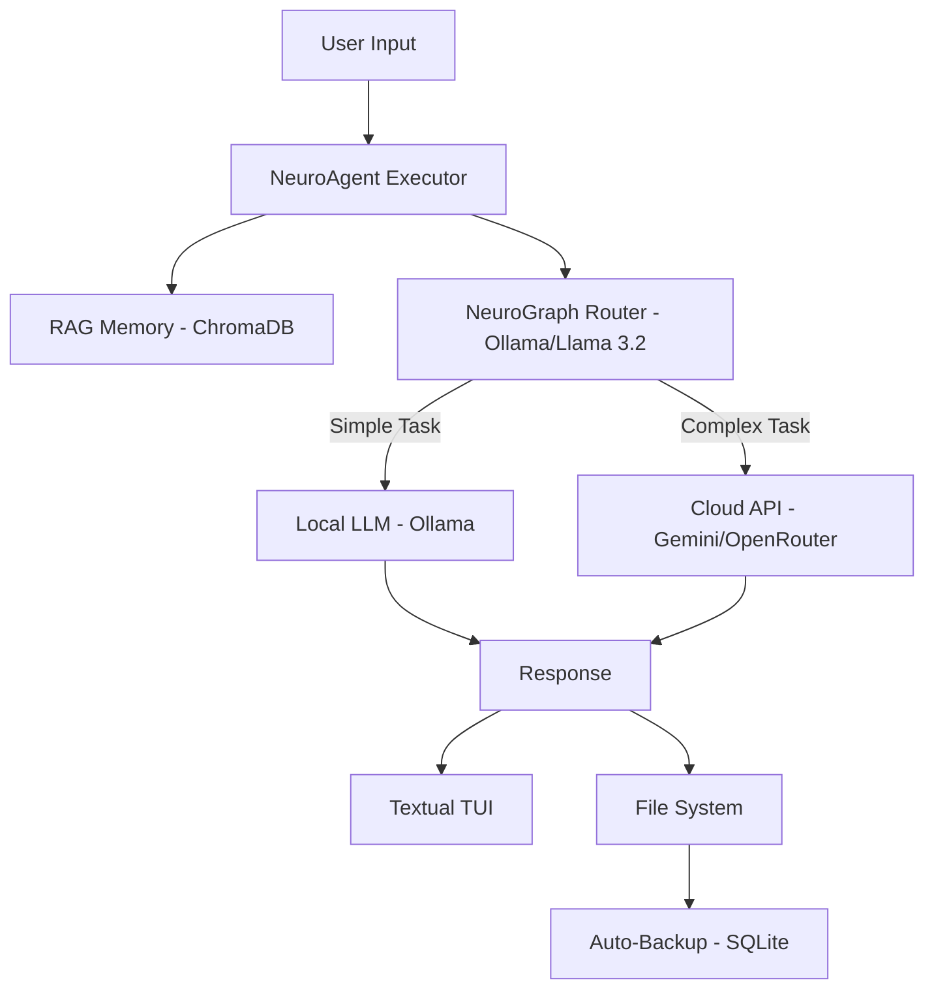

# 👁️ CodeVue (NeuroTerm v3.0)

> **AI Code Companion (RAG,LangGraph)**
> A terminal-based, agentic AI coding environment that remembers your projects, routes tasks intelligently, and autonomously fixes bugs.


---

## 🚀 Overview

CodeVue is a fully **Agentic System** that lives in your terminal. It combines local AI (Ollama) for speed and privacy with cloud AI (Gemini/OpenRouter) for complex reasoning.

**Key Capabilities:**
* **🧠 RAG Memory:** Remembers past conversations and code context (using ChromaDB & SQLite).
* **🚦 Smart Routing (LangGraph):** Automatically sends simple tasks to a free local model and complex tasks to paid cloud APIs.
* **🔄 Auto-Fix Loop:** Can run a script, read the error traceback, and apply a fix autonomously until it works.
* **🛡️ Safety First:** Creates timestamped backups before every file edit.

---

## 🏗️ Architecture



### 🤖 Core Stack
- **Frontend:** Textual (Modern TUI framework)
- **Orchestration:** LangGraph
- **Memory:** ChromaDB + SQLite
- **Local AI:** Ollama (llama3.2, nomic-embed-text)
- **Cloud AI:** Google Gemini / OpenRouter

---
 

## ⚡ Installation

### Prerequisites
- Python 3.10+
- Ollama installed and running

### Setup
```bash
git clone https://github.com/martin861101/codevue.git
cd codevue
python3 -m venv venv
source venv/bin/activate
pip install -r requirements.txt
```

### Pull Models
```bash
ollama pull llama3.2
ollama pull nomic-embed-text
```

### Configure API Keys (Optional)
```bash
export GEMINI_API_KEY="your_key"
export OPENROUTER_API_KEY="your_key"
```

---

## 🎮 Usage
```bash
python3 app.py
```

## ⌨️ Commands

| Command | Description |
|------|------------|
| /test <file.py> | Autonomous debug & fix |
| /allow write | Enable file editing |
| /log | View recent logs |
| /debug | Toggle debug output |
| /provider <name> | Switch AI provider |
| /scan [path] | List files |
| /read <file> | Load file into context |
| /help | Help menu |

---

## 🐞 Troubleshooting

- **ModuleNotFoundError**: Reinstall dependencies.
- **Ollama Error**: Ensure `ollama serve` is running.
- **Missing Logs**: Create `system.log` manually.

---


## 📂 Folder Structure
---

```bash
codevue/
├── codevue		   # Global Entry Point (TUI)
├── app.py                 # Main Entry Point (TUI) 
├── update_system.py       # OTA Update Script
├── requirements.txt       # Dependencies
├── system.log             # Live System Logs
├── neuroterm.db           # SQLite History & Backups
├── neuroterm_chroma/      # Vector Database
│
└── core/
    ├── agent.py           # The Orchestrator
    ├── graph.py           # The Router (Brain)
    ├── memory.py          # The Memory (RAG)
    ├── files.py           # File System Tools
    ├── logger.py          # Central Logging
    └── providers/         # API Wrappers
        ├── ollama.py
        ├── gemini.py
        └── openrouter.py
```

---
## 🤝 **Contributing**
We love contributors! 🚀
- Fork the repo
- Follow PEP8 for Python code
- Add tests for new features
- Submit PRs with clear descriptions
---
Built with 💻 and ☕ by **Martin Schoeman**


